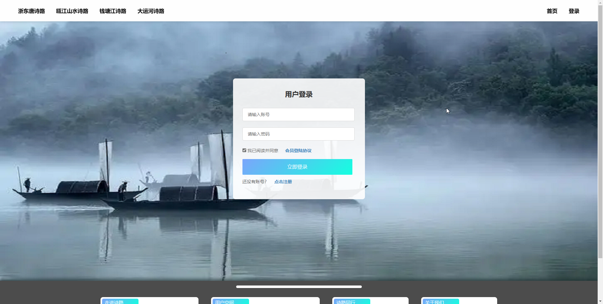
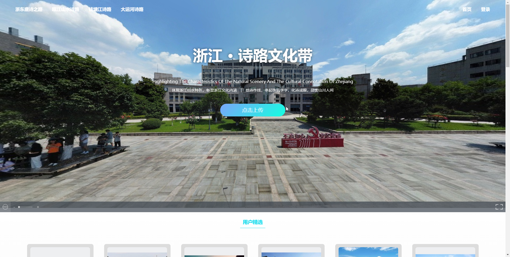
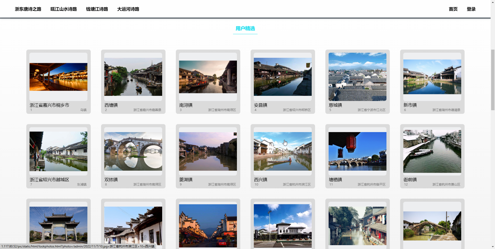
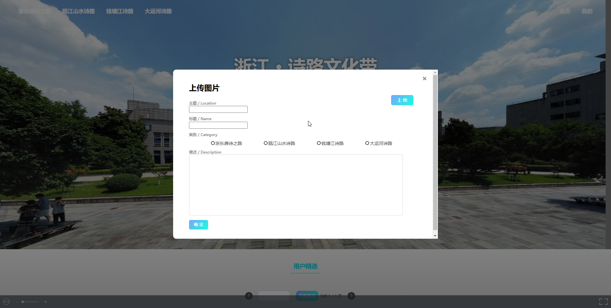
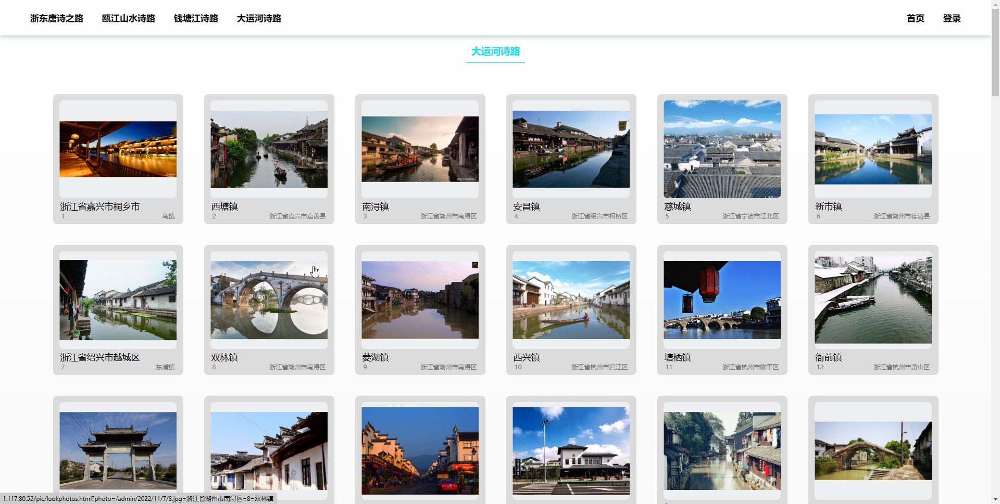
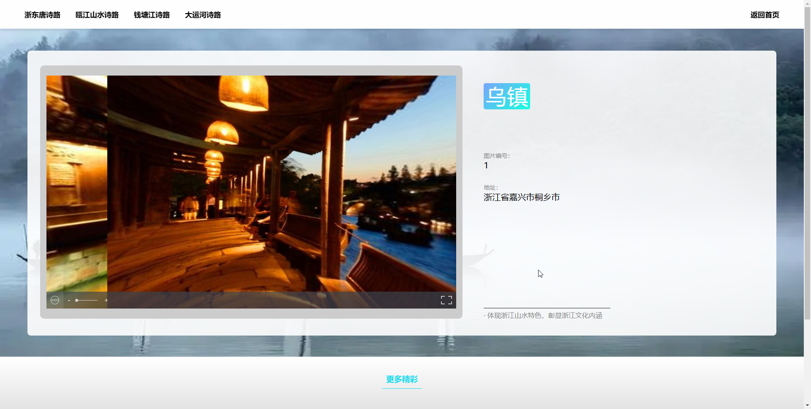
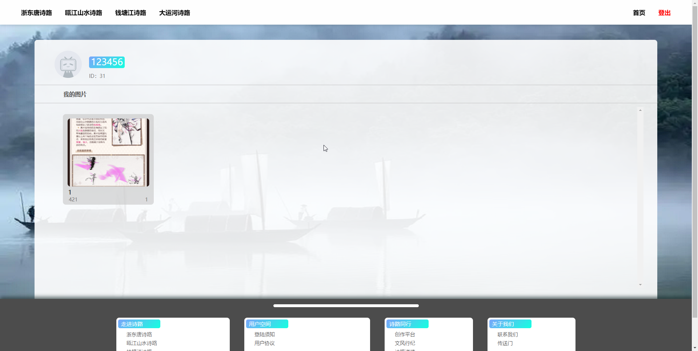
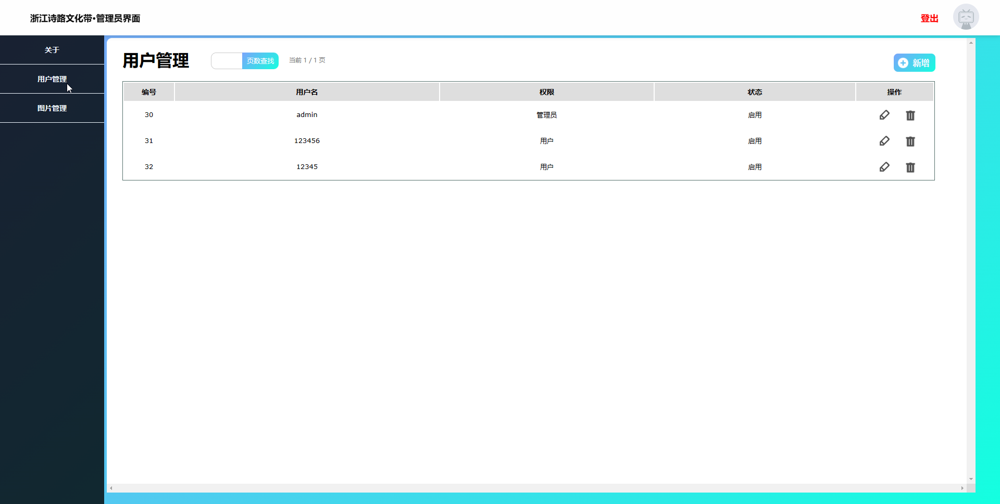
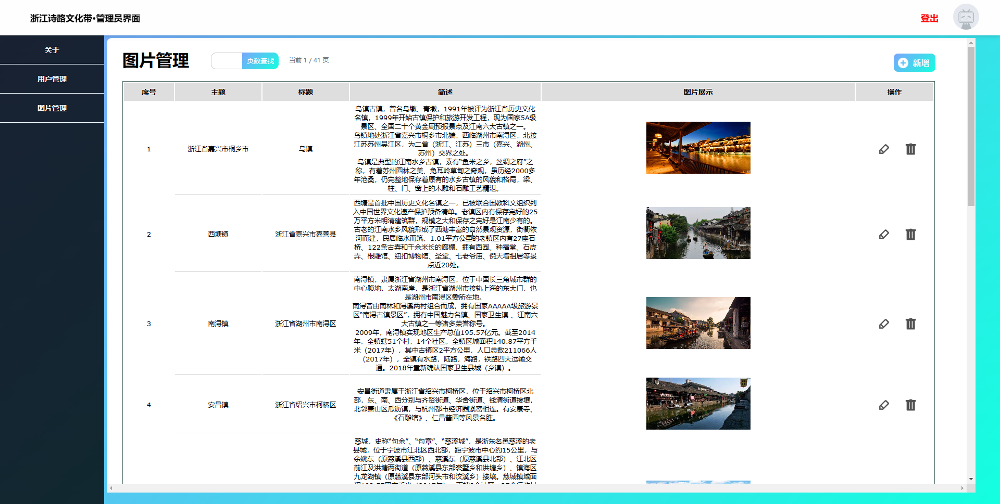

# 浙江诗路


## 一、项目介绍

#### 1. 项目名称
浙江诗路信息展示及后台管理系统

#### 2. 项目功能
- 用户浏览和上传图片 展示信息
- 管理员管理用户和图片

#### 3. 项目简介
- 前端：HTML、CSS、JavaScript、JQuery、axios、three.js
- 后端：SpringBoot、MyBatis-plus、MySQL、JWT、COS服务
- 项目管理：Maven
- 项目部署：nginx 反向代理
- 项目版本管理：Git
- 项目协作：Github
- 接口文档：https://www.apifox.cn/apidoc/shared-77cc6811-e4ee-4f67-ab1d-5e87632aac1f/api-46594096
- 项目地址：http://1.117.80.52/pic

##### 4. 项目结构
```
├─docs 项目文档
├─front 前端项目
  ├─static 静态资源
    ├─css 样式
    ├─html 页面
    ├─imgs 图片
    ├─js 脚本
├─src 后端项目
├─sql 数据库文件
```

#### 5. 项目特点
- 前后端分离
- 前端引入three.js实现3D效果，并实现分页，权限判定展示页面
- 后端引入腾讯云的COS对象存储，实现图片上传，学了相关的SDK

## 二、项目演示
普通账号密码 123456
管理员账号密码 admin

- 登录 
- 首页 
- 图片概览 
- 图片上传 
- 分类图片详情 
- 图片详情 
- 用户中心 
- 用户管理界面 
- 管理员界面 

## 三、项目启动
1. 前端 修改axios的接口地址 使用nginx或者github pages部署
2. 后端 修改yml配置文件 配置好cos存储 并使用maven打包成jar包  运行jar包即可
3. 数据库 使用sql文件导入数据库 数据库名zjslpic
